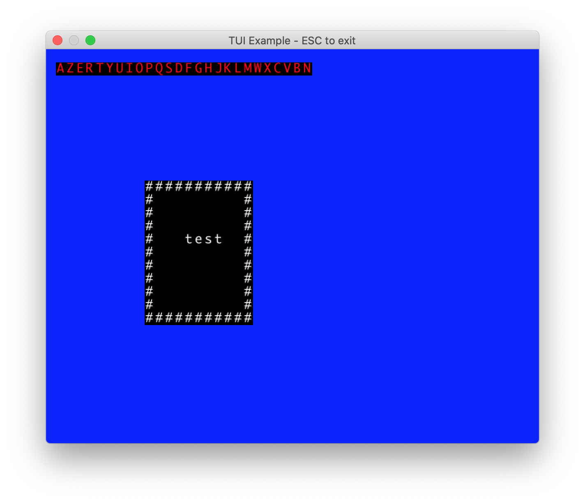

# rTUI 

An attempt to create a simple tool for build Textual User Interface outside of the terminal. 

This is an exec for now but will be a lib (not related to minifb).

*Why ?* 

The main purpose for this is to build debugging tool and utility developpement. 
I want them outside of the terminal to allow me to and more rich feature in a near futur like image or event video. 

# Example

Here a basic example : 

```rust
extern crate minifb;
extern crate r_tui;
use std::{thread, time};
use minifb::{Key, WindowOptions, Window};

use r_tui::color_table;
use r_tui::screen;
use r_tui::view;

const WIDTH: usize = 50;
const HEIGHT: usize = 30;
const FONT_SIZE: usize = 16;
const TITLE: &str = "TUI Example - ESC to exit";

fn main() 
{

	let mut screen = screen::Screen::new(WIDTH,HEIGHT,FONT_SIZE,color_table::BLUE);
	screen.draw_at(&String::from("AZERTYUIOPQSDFGHJKLMWXCVBN"),1,1,color_table::RED,color_table::BLACK);

	let mut view  = view::View::new(10,10,10,10);
	view.draw_at(String::from("test"),3,3);

	let window = Window::new(TITLE,screen.real_width(),screen.real_height(),WindowOptions::default());
	let mut window = window.unwrap_or_else(|e| {panic!("{}", e);});

	let sixiteen_millis = time::Duration::from_millis(16);
	while window.is_open() && !window.is_key_down(Key::Escape)
	{
		let start = time::Instant::now();
		view.apply(&mut screen);
		// do stuff here
		let delta = time::Instant::now() - start;
		if sixiteen_millis > delta {
			thread::sleep(sixiteen_millis-(delta));
		}
		if screen.is_dirty()
		{
			window.update_with_buffer(screen.buffer()).unwrap();
		}
		else{
			window.update();
		}
	}
}
```



To run it just do :
```bash
cd example; cargo run
```

Later I'll Add a more intersting example. Rigth now there is not much more to say than this screenshot show. 


# Usage 

There is 3 main struct : 

 * `Screen` : hold the pixel buffer and expose a basic draw at function. 
 * `View` : allow to split the screen into several area. Also have more advande drawing function
 * `color_table` : not a struct, but a module wich list basic color to start width. 

## Color table

*  : `color_table::BLACK`
*  : `color_table::NAVY`
*  : `color_table::BLUE`
*  : `color_table::GREEN`
*  : `color_table::TEAL`
*  : `color_table::DODGEBLUE`
*  : `color_table::LIME`
*  : `color_table::SPRING`
*  : `color_table::AQUA`
*  : `color_table::MAROON`
*  : `color_table::PURPLE`
*  : `color_table::ELECTRIC_INDIGO`
*  : `color_table::OLIVE`
*  : `color_table::GRAY`
*  : `color_table::LIGHT_SLATE_BLUE`
*  : `color_table::CHARTREUSE`
*  : `color_table::LIGHT_GREEN`
*  : `color_table::ELECTRIC_BLUE`
*  : `color_table::RED`
*  : `color_table::DEEP_PINK`
*  : `color_table::FUCHSIA`
*  : `color_table::ORANGE`
*  : `color_table::LIGHT_CORAL`
*  : `color_table::FUSHIA_PINK`
*  : `color_table::YELLOW`
*  : `color_table::WITCH_HAZE`
*  : `color_table::WHITE`


